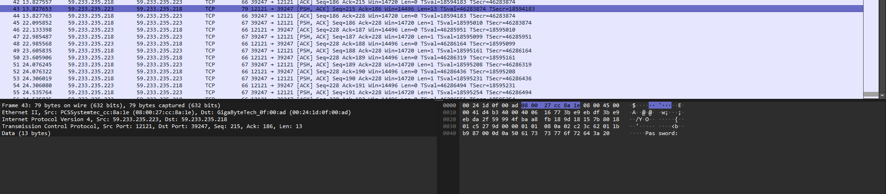
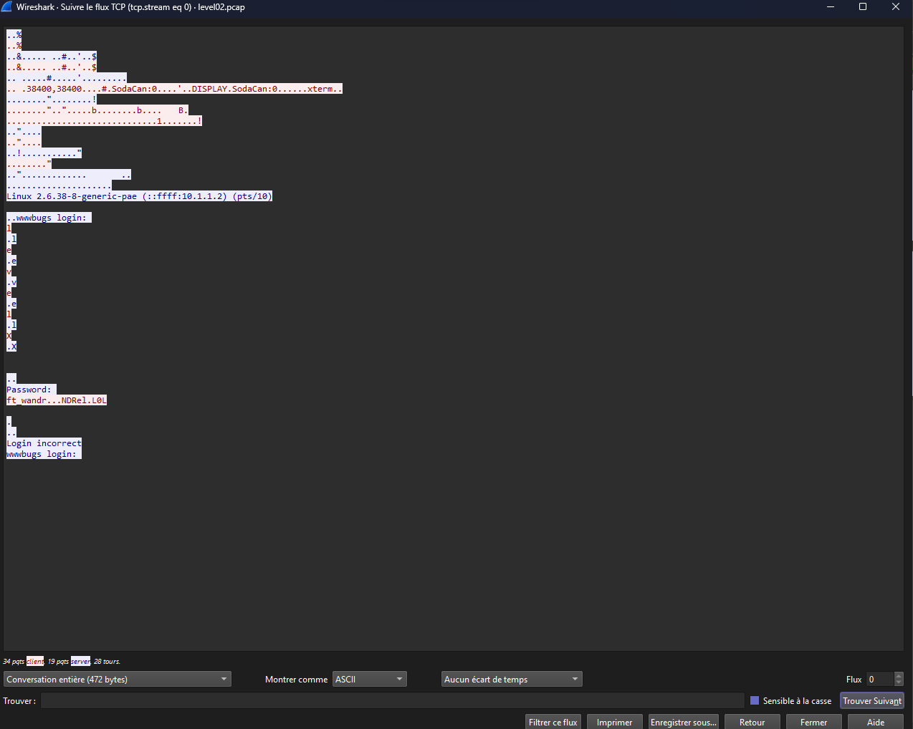

# Snow Crash – Level02

## 🎯 Objectif  
Analyser une capture réseau (`.pcap`) avec Wireshark pour récupérer un mot de passe saisi en clair, puis accéder au compte `flag02`.

---

## 📥 1. Récupération du fichier `level02.pcap`

```bash
scp -P 4242 level02@192.168.1.92:/home/user/level02/level02.pcap .
```

---

## 🔍 2. Analyse dans Wireshark

- Ouvrir le fichier `level02.pcap`
- Aller à la **ligne 43**



- Faire **clic droit > Follow > TCP stream**
- On observe un mot de passe partiel : `ft_wandr...NDRel.L0L`



🧪 Afficher les données en **tableau C** (View as: C Arrays) pour décoder les caractères non imprimables.


---

## 🔢 3. Reconstitution du mot de passe

### 🔎 Analyse des paquets :
```
char peer0_13[] = { 0x66 }; // f
char peer0_14[] = { 0x74 }; // t
char peer0_15[] = { 0x5f }; // _
char peer0_16[] = { 0x77 }; // w
char peer0_17[] = { 0x61 }; // a
char peer0_18[] = { 0x6e }; // n
char peer0_19[] = { 0x64 }; // d
char peer0_20[] = { 0x72 }; // r
char peer0_21[] = { 0x7f }; // Delete
char peer0_22[] = { 0x7f }; // Delete
char peer0_23[] = { 0x7f }; // Delete
char peer0_24[] = { 0x4e }; // N
char peer0_25[] = { 0x44 }; // D
char peer0_26[] = { 0x52 }; // R
char peer0_27[] = { 0x65 }; // e
char peer0_28[] = { 0x6c }; // l
char peer0_29[] = { 0x7f }; // Delete
char peer0_30[] = { 0x4c }; // L
char peer0_31[] = { 0x30 }; // 0
char peer0_32[] = { 0x4c }; // L
```

📌 On déduit que l’utilisateur a supprimé des lettres puis corrigé.

---

## 🔑 4. Mot de passe trouvé :
```txt
ft_waNDReL0L
```

---

## 🧪 5. Connexion à `flag02`

```bash
su flag02
Password: ft_waNDReL0L
```

---

## 🏁 6. Récupération du flag :

```bash
getflag
```

**Résultat :**
```
Check flag.Here is your token : kooda2puivaav1idi4f57q8iq
```

---

## ✅ Résumé

- 🔐 Mot de passe `flag02` : `ft_waNDReL0L`  
- 🏆 Token `flag02` : `kooda2puivaav1idi4f57q8iq`  
- 🔑 Mot de passe `level03` : `kooda2puivaav1idi4f57q8iq`
